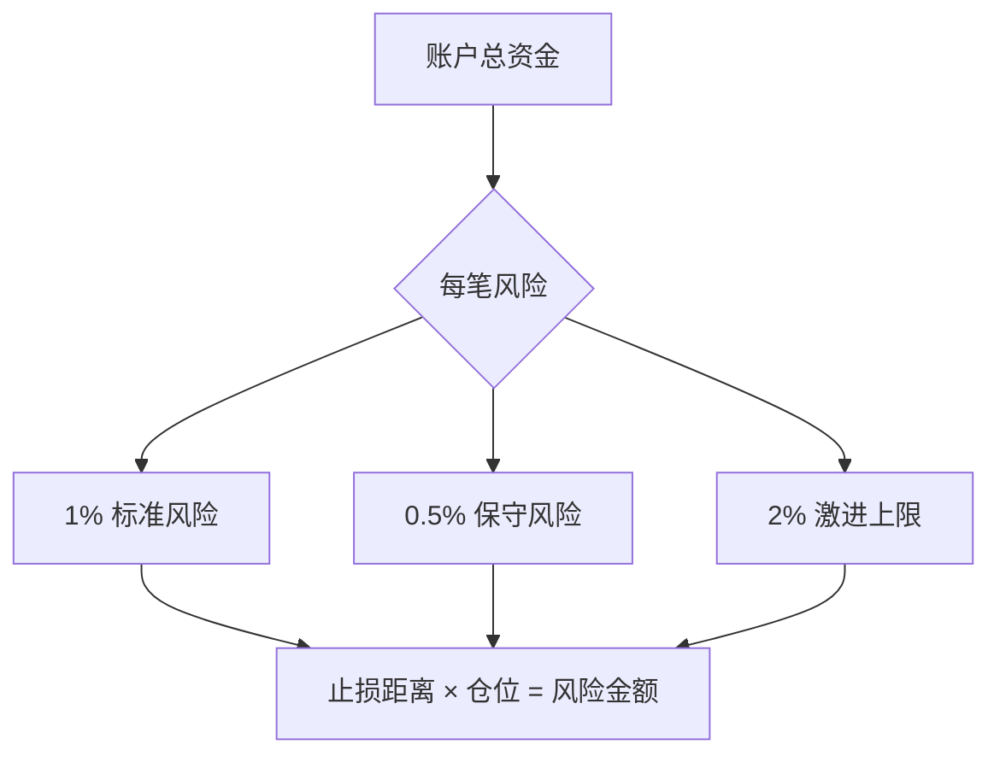

# ✅ 交易规则与纪律清单

> [!danger] 红线规则（不可违反）
> - [ ] 绝不在没有止损的情况下开仓
> - [ ] 单笔亏损不超过总资金的 **1-2%**
> - [ ] 不追涨杀跌（偏离关键价位 X% 以上不追）
> - [ ] 不在连续亏损后报复性交易
> - [ ] 不在重大新闻公布前重仓

---

## 📋 开仓前检查清单

> [!warning] 开仓前必须确认
> - [ ] 是否有明确的入场信号？
> - [ ] 当前趋势是否支持我的交易方向？
> - [ ] 止损位是否合理且可执行？
> - [ ] 止盈/目标位是否明确？
> - [ ] 盈亏比是否 ≥ 1:2？
> - [ ] 仓位大小是否符合资金管理规则？
> - [ ] 是否有重大经济数据即将公布？
> - [ ] 当前波动率是否在可接受范围内？
> - [ ] 我的情绪状态是否适合交易？
> - [ ] **这笔交易是否符合我的交易计划？**

---

## 📋 持仓中检查清单

> [!info] 持仓监控
> - [ ] 止损位是否已调整（移动止损）？
> - [ ] 市场是否有超预期的变化？
> - [ ] 持仓是否影响判断客观性？
> - [ ] 是否出现了出场信号？

---

## 📋 平仓后检查清单

> [!question] 平仓复盘
> - [ ] 平仓理由是什么？（止损/止盈/手动）
> - [ ] 这笔交易是否按计划执行？
> - [ ] 是否有情绪化决策成分？
> - [ ] 学到了什么？
> - [ ] 已记录到 [[交易日志/交易日志模板|当日交易日志]]

---

## 📊 资金管理规则



> [!example] 仓位计算公式
> ```
> 仓位 = 账户资金 × 风险比例 ÷ 止损距离（点数）
> ```
> 
> **示例**: 账户 $10,000, 风险 1%, 止损 20 点
> ```
> 仓位 = $10,000 × 1% ÷ 20 = 0.5 手（标准手）
> ```

---

## ⏰ 交易时段规则

| 时段 | 允许交易 | 注意事项 |
|------|---------|---------|
| 开盘前 30min | ❌ | 观察不交易 |
| 主交易时段 | ✅ | 主要策略执行时间 |
| 午间休盘 | ⚠️ | 仅轻仓或平仓 |
| 尾盘 | ✅ | 仅做趋势跟踪 |
| 重大数据公布前后 15min | ❌ | 等待市场稳定 |

---

## 🔄 纪律违规处罚机制

| 违规行为 | 处罚 |
|---------|------|
| 情绪化交易 | 暂停交易 1 天 |
| 未设止损开仓 | 暂停交易 3 天 |
| 连续 3 次违反规则 | 暂停交易 1 周 + 重新学习交易系统 |
| 报复性交易 | 暂停交易 1 周 |

---

> [!quote]
> "纪律是交易者和赌徒之间的分界线。"
